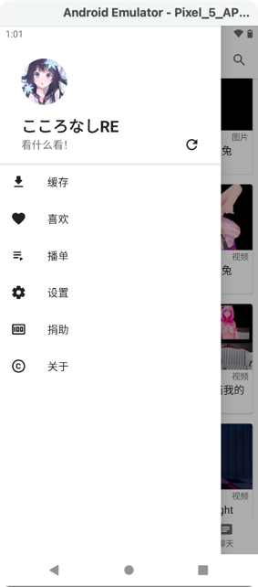

# Iwara4A

A android application for iwara.tv, based on Jetpack Compose and some other modern Android develop tech stack

## ⬇ Download
https://github.com/jiangdashao/iwara4a/releases/latest

## Screenshot
The screenshot maybe outdated
| Index | Player | Drawer | Search |
| ----- | ------| ------| ------|
| | |  | 

## 🚩 特性
* Material You Design!
* Login
* View Videos/Images List
* Play videos
* View Images
* View comments
* Like
* Subscribe
* Comment
* Share
* Search
* Sort
* History
* Download
* ...

## 🎨 Tech Stack
* MVVM 
* Single Activity + Navigation
* Jetpack Compose 
* Kotlin Coroutine
* Okhttp + Jsoup
* Retrofit
* Hilt 
* Paging3
* Navigation